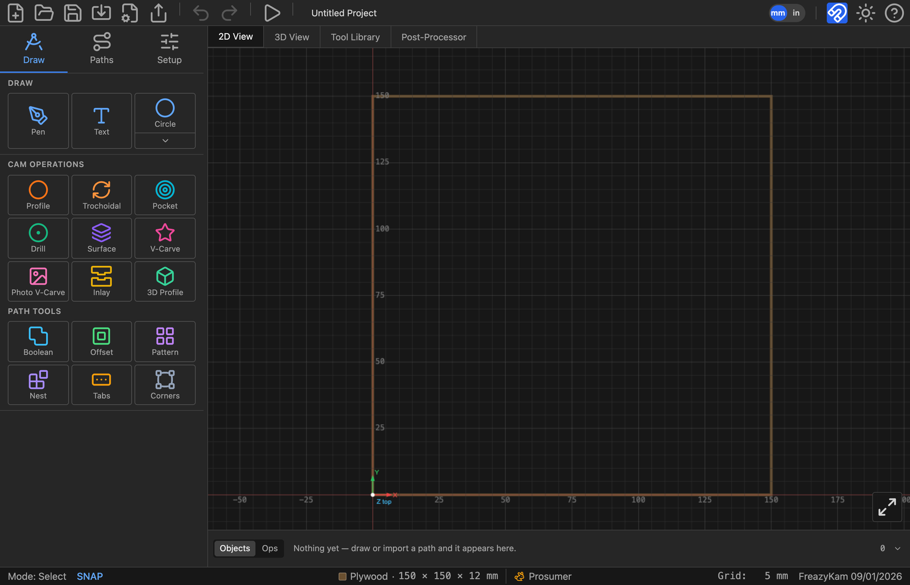
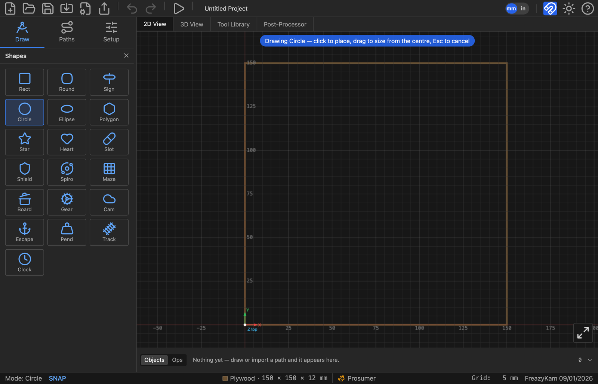
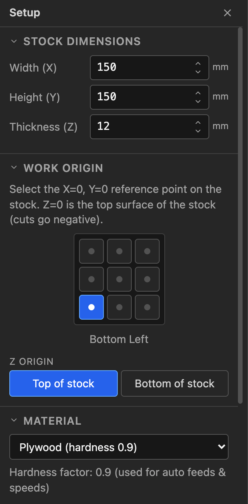
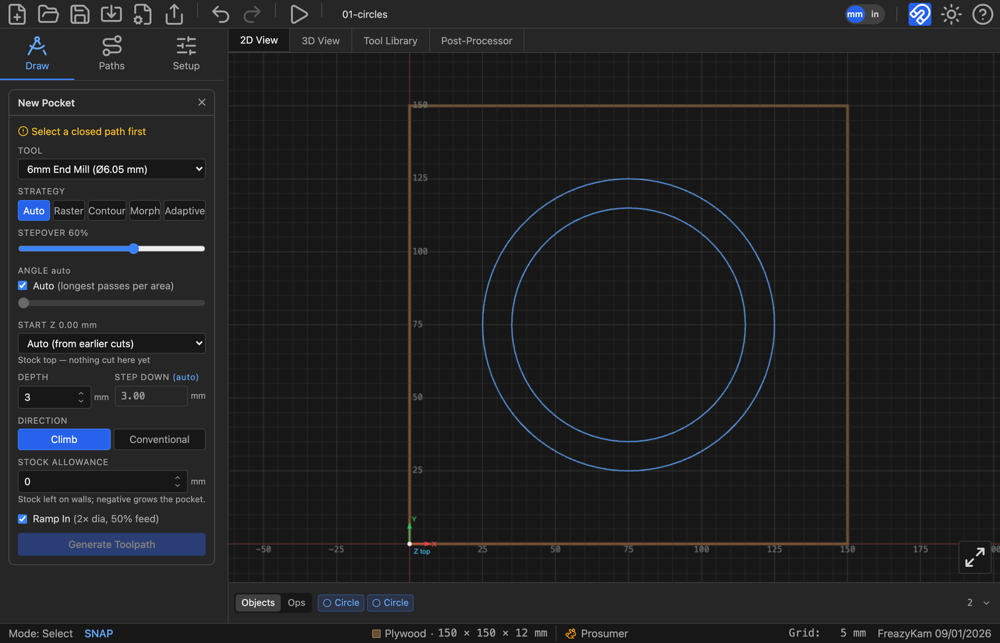
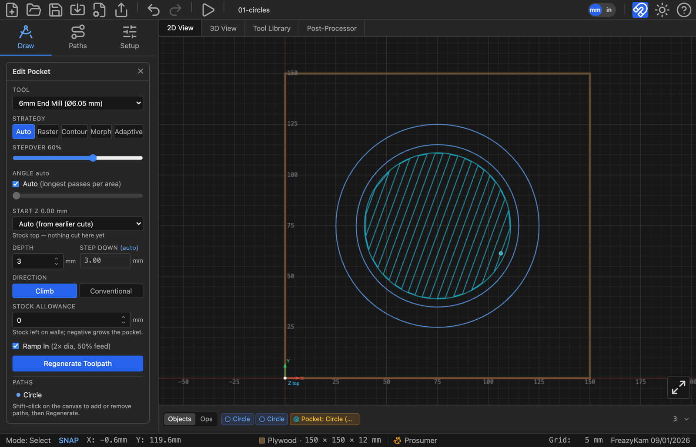
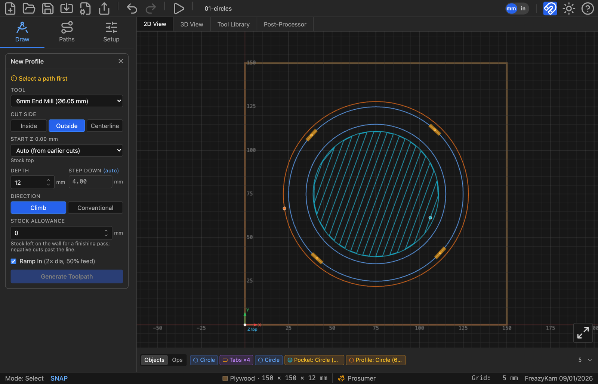
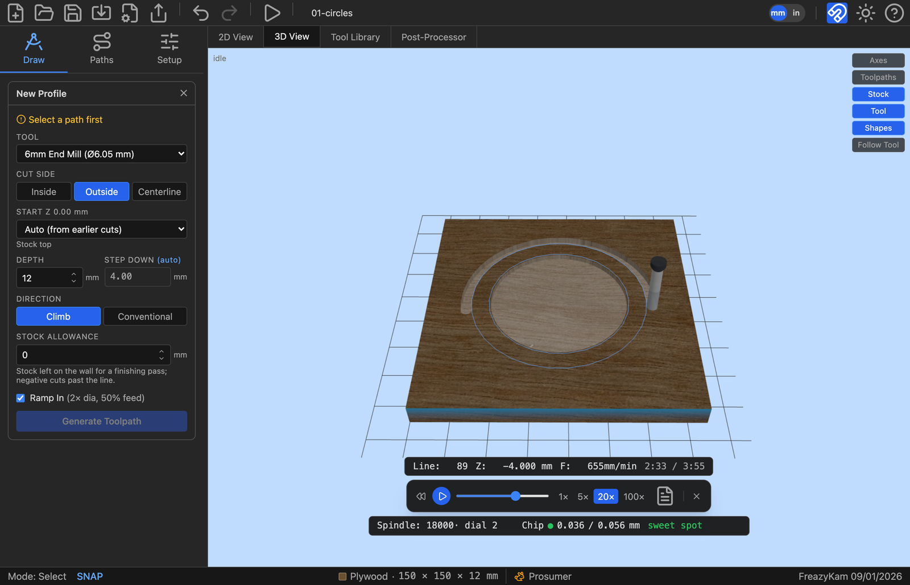

# 1. Quick Start — your first part

We are going to make a **coaster**: a 100 mm disc with a shallow recess in the face,
cut from 12 mm stock and held in by tabs so it doesn't fly off the table on the last
pass.

It is a small job, but it uses every part of the app you will use on every job after
it — stock setup, the tool library, two operations, the simulator, and export. Allow
about twenty minutes.

> **What you need:** a browser. Nothing to install, no account. Work is saved to your
> own computer as a `.fkam` file when you ask for it.
>
> **The finished project is [`01-circles.fkam`](01-circles.fkam)** — download it and use
> the toolbar's Open button if you get stuck, or to compare against what you built. Build
> it yourself first, though: the point of this chapter is the doing.

---

## The app at a glance

Open the app and this is what you get — an empty project on a default piece of stock.

<!-- FULL APP · 1600 px wide, downscaled from the 2800 px capture. Default state,
     Draw tab, nothing drawn. -->

Five regions, and everything in this guide happens in one of them:

| Region | Where | What it's for |
|---|---|---|
| **Toolbar** | across the top | New / open / save, import, export G-code, export SVG, undo / redo, simulate, and on the right the mm ⇄ inch toggle, snap, theme and **?** help |
| **View tabs** | under the toolbar | **2D View** to draw and generate, **3D View** to watch material come off, **Tool Library** for your cutters, **Post-Processor** for your controller's dialect |
| **Sidebar** | down the left | Three tabs: **Draw** (the menu in the picture), **Paths** (a list of everything in the project), **Setup** (stock, origin, material, feeds) |
| **Canvas** | the middle | Your geometry and toolpaths, in millimetres, with X0 Y0 marked |
| **Strips** | along the bottom | **Objects** — what's in the project · **Ops** — what the machine will do, in order. Below them the status bar shows the current mode, the stock, and the grid |

### The Draw tab is the menu for everything

The sidebar's **Draw** tab holds three groups, and every job is a matter of picking
something from one of them:

- **Draw** — **Pen** for freehand paths, **Text** for lettering, and a **shape button**.
  The shape button shows whichever shape you used last (Circle in the picture); click it
  to arm that shape, or click the **chevron beneath it** to open the [shape
  picker](#the-shape-picker).
- **CAM Operations** — the nine ways of cutting: Profile, Trochoidal, Pocket, Drill,
  Surface, V-Carve, Photo V-Carve, Inlay, 3D Profile. **Select geometry first, then click
  one.**
- **Path Tools** — the six ways of changing geometry rather than cutting it: Boolean,
  Offset, Pattern, Nest, Tabs, Corners.

**Clicking any of these replaces the menu with that tool's form.** Fill it in, press the
button at its foot, and close it with the **×** in its header to come back to the menu.
That one gesture — *select something, click a tool, fill in the form, close it* — is the
whole app. The rest of this chapter does it four times.

> Nothing is offered that can't work: an operation only lists tools from your library
> that can actually make the cut, and one needing a closed shape says so rather than
> failing later.

### The shape picker

The chevron under the shape button swaps the sidebar for the picker:

<!-- FULL APP · 1600 px wide. Picker open, Circle armed, canvas hint banner showing. -->

Eighteen shapes and the clock designer, in three families:

| Family | Buttons | |
|---|---|---|
| **Outlines** | Rect · Round · Sign · Circle · Ellipse · Polygon · Star · Heart · Slot · Shield | Everyday geometry, each with its own parameters |
| **Generated patterns** | Spiro · Maze | A curve or a route computed from a rule rather than drawn |
| **Real parts** | Board · Gear · Cam · Escape · Pend · Track · Clock | Working mechanisms, not lookalikes — a gear is a true involute profile, and the clock is a whole going train solved from the beat |

Click one and the picker closes, that shape is armed, its parameters appear under the
Draw menu, and a banner across the canvas tells you what the next click will do —
*"Drawing Circle — click to place, drag to size from the centre, Esc to cancel."* The
status bar bottom-left changes from `Mode: Select` to `Mode: Circle` so you always know
what a click is about to do. **Esc** puts you back to selecting.

The button then remembers that shape, so drawing another takes one click, not two.

> **Gear, Escapement, Pendulum and Track ignore drag-sizing.** They are placed at the
> size their own parameters give them — a gear's size comes from its module and tooth
> count, a pendulum's from the beat you want, a track piece's from what it has to connect
> to. Dragging cannot make a gear that meshes wrong.

---

## 1. Set up the stock

Before anything else, tell the app what is on your table. The stock is the reference
everything else is measured from — cut depths, the origin, the simulation, and the
warnings you get at export.

Click **Setup** in the sidebar tab bar (next to *Draw* and *Paths*). The sidebar fills
with the setup panel, and the 2D view keeps showing the stock so you can see your edits
land as you make them.

Set:

| Field | Value |
|---|---|
| Width (X) | `150` |
| Height (Y) | `150` |
| Thickness (Z) | `12` |

Under **Work Origin**, pick where X0 Y0 sits on the stock. The bottom-left corner is
the default and is what most hobby machines are jogged to. Leave **Z Origin** on
**Top of stock** — Z0 at the surface, cuts going negative, which is what you get when
you zero the bit on the workpiece with a touch plate or a piece of paper.

Under **Material**, choose the wood you are actually cutting. It is not cosmetic: the
material's hardness feeds the automatic feeds and speeds, and it drives the chip-load
warnings later.

Close the setup panel with the **×**.

*Stock, origin and material — everything else in the project is measured from these.*

<!-- CROP · sidebar only (x 0-640 of the 2800 px capture), Setup header down through
     Material. Native 2×, 640 px wide. Fields must be readable. -->

**Working in inches?** Click the units button in the toolbar and type inches instead.
It changes what you see and type, never what is stored, so you can flip back and forth
at any time and share the file with someone working in mm.

---

## 2. Draw the coaster

Go to the **Draw** tab.

1. Click the **shape button** under DRAW. If it isn't already showing Circle, click the
   chevron beneath it and pick **Circle** from the picker.
2. Set **Radius** to `50` in the parameters that appear below.
3. Click once in the middle of the stock on the canvas.

The circle is placed at the size you typed, centred on where you clicked. (You could
also have dragged to size it by eye — click places at the typed size, drag sizes
interactively.)

Now the recess:

1. With the Circle tool still active, change **Radius** to `40`.
2. Click again on the *same point*. Because a click always centres the shape on the
   cursor, the two circles come out concentric.

You now have two paths. Press **Escape** to leave the shape tool and return to select.

> **From centre** is about *dragging*, not clicking. Tick it and a drag grows the shape
> outward from where it started instead of running corner to corner — drag repeatedly
> from one point and you get concentric shapes without measuring. It also makes the
> shape resize about its middle afterwards. It rides with each object, so you can change
> it later from that object's properties.

*Both circles are still shapes, not frozen outlines — each chip in the Objects strip
reopens the editor that made it.*

<!-- FULL APP · 1600 px wide. Objects tab selected in the bottom strip. -->

Click either circle and the Properties panel gives you back **Radius**, not a frozen
outline — that stays true for the life of the project.

---

## 3. Check your tool

Click the **Tool Library** tab above the canvas. The library ships with a starter set
of cutters and is saved both with the project and in your browser between sessions.

Find a **6 mm end mill**, or add one with **+**. What matters for this job:

| Column | Means |
|---|---|
| Diameter | The cutting diameter. Everything the CAM does is offset from this |
| Flutes | Used with RPM and feed to work out chip load |
| RPM / XY Feed / Z Feed | Starting numbers — leave **Auto Feeds & Speeds** on and the app sets them per cut |
| Max Z | The deepest this tool may ever cut — its usable flute length. Ask for more and the depth field warns *Exceeds tool Max Z* |

**An operation only lists the tool types that can do its job.** Pocket offers end mills
and ball noses; V-Carve offers V-bits and tapers; Drill offers drills. So if a cutter you
expected isn't in the list, it is the wrong *type* for that operation — not the wrong
size. Max Z never hides a tool; it warns you in the depth field instead.

Return to the **2D View** tab.

---

## 4. Pocket the recess

Select the **inner (80 mm) circle** on the canvas.

In the **Draw** tab, the lower half of the sidebar is the operation menu. Under
**CAM Operations**, click **Pocket**.

Set:

| Field | Value | Why |
|---|---|---|
| Tool | 6 mm end mill | |
| Strategy | **auto** | Picks per area — raster in the open, contour around anything in the way |
| Start | **Auto** | Starts at the top of uncut stock |
| Depth | `3` | A 3 mm recess |
| Step down | leave as offered | Derived from the tool and material |
| Direction | **climb** | The normal choice on a router in wood |
| Stock allowance | `0` | No finishing pass on a coaster recess |

Click **Generate Toolpath**.

The toolpath appears on the canvas, and a chip for it appears in the **Ops** strip
along the bottom.

*The auto strategy rasters the open ground and contours the boundary.*

<!-- FULL APP · 1600 px wide. Ops tab selected in the bottom strip so the new
     Pocket chip is visible. -->

---

## 5. Add holding tabs

If we cut the outline now, the coaster comes free on the last pass and gets thrown by
the cutter. Tabs are small bridges of uncut material that hold the part in place until
you cut them with a chisel.

Select the **outer (100 mm) circle**. Under **Path Tools**, click **Tabs**.

| Field | Value |
|---|---|
| Count | `4` |
| Length | `8` |
| Height | `2` |

Click **Apply Tabs**. Four tabs appear on the circle, evenly spaced. Drag any of them
along the path to move it — put them where you would rather have the cleanup work.

Tabs are attached to the path, not to an operation, and they get their own chip in the
Objects strip. Any profile cut on this path will honour them.

---

## 6. Cut the outline

With the **outer circle** still selected, click **Profile** under CAM Operations.

| Field | Value | Why |
|---|---|---|
| Tool | 6 mm end mill | |
| Cut Side | **outside** | The line is the finished edge of the part, so the tool must run outside it |
| Start | **Auto** | |
| Depth | `12.5` | Slightly past the 12 mm stock so the part separates cleanly |
| Step down | leave as offered | |
| Direction | **climb** | |
| Stock allowance | `0` | |
| Ramp In | ticked | Enters each pass on a slope instead of plunging straight down |

**Cut side is the field to get right.** *Outside* leaves the part at the size you drew.
*Inside* is for holes — the drawn line is the finished wall of the hole. *Centerline*
runs the tool's axis down the line, which is what you want for a groove, and takes half
the tool width off each side of your geometry.

Click **Generate Toolpath**.

*The four breaks in the outer path are the tabs — the material that holds the coaster
in the sheet until you cut it out by hand.*

<!-- FULL APP · 1600 px wide. Zoom so the tab gaps are clearly visible. -->

---

## 7. Check the order

Look at the strip under the canvas. It has two tabs, and they are not the same thing:

- **Objects** is your *document* — one chip per thing in the project. The two circles,
  the tabs, the pocket, the profile. Click a chip to select the thing and reopen the
  editor that made it.
- **Ops** is your *program* — one chip per toolpath, **in the order the machine runs
  them**, which is the order they are written to G-code.

Switch to **Ops**. You should see **Pocket** then **Profile**. That order matters: cut
the recess while the coaster is still solidly attached to the sheet, and cut it free
last. If they are the other way round, drag the Pocket chip in front of the Profile
chip.

Operations that share a tool are drawn as one coloured band with a marker at each tool
change, so you can see at a glance how many times you will be at the machine swapping
bits.

---

## 8. Simulate it

Click **Simulate G-code** in the toolbar.

The 2D view plays the program with a cut trail behind the tool. Click the **3D View**
tab to watch the same run remove material from a solid block — this is the view that
shows you what the part will actually look like.

The player controls sit along the bottom:

- **Play / Pause** — or the spacebar
- **Reset** — back to the start
- The **seek slider** — scrub anywhere in the program
- **1× 2× 4×…** — playback speed
- The **document icon** — opens the G-code viewer, which follows along line by line

The stats bar above shows the current **line number**, the tool's **Z**, and the
current **feed** — with the elapsed and total cycle time on the right. That time
estimate is worth a look before you commit an hour of spindle time.

In the 3D view, the buttons top-right toggle **Axes, Toolpaths, Stock, Tool, Shapes**
and **Follow Tool**.

*Paused at 2:33 of 3:55. The recess is cut and the cutter is part way round the outline,
so you can see exactly how much of the job is left. The readout under the stock gives the
line number, Z, feed, and the chip load — green here, which is where you want it.*

<!-- FULL APP · 1600 px wide. Paused mid-profile with the tool visibly engaged and both
     cut and uncut material in frame. -->

What the simulation proves is that the toolpaths do what you meant. It does not know
whether your machine is trammed, whether the stock is where you think it is, or whether
the bit is sharp. Close it with the **×** on the player.

---

## 9. Export the G-code

Click the **Post-Processor** tab and check the active profile is right for your
controller. **Grbl (mm)** is the default and covers most hobby machines; **Grbl
(inches)**, **grblHAL**, **LinuxCNC**, **Mach3**, **UCCNC** and a **Generic** profile are
built in too. Any profile, built-in included, can be edited —
a built-in carries a **Reset** button that puts it back to factory defaults, so you can
experiment without losing the original. To keep both, duplicate a profile and edit the
copy.

Back in the toolbar, click **Export G-code**. Before writing anything, the app runs a
preflight check and shows you the result as a **G-code review**:

- Operations that failed, or that were edited after their toolpath was generated and
  are now stale
- Toolpath that runs outside the stock, or past your machine's table travel
- Tool changes and spindle-speed commands your controller may not act on
- Feeds and speeds that put chip load outside a safe band for the material

Warnings do not block you — the button reads **Export anyway** — but read them. They
are the last thing standing between a mistake and a broken cutter.

The review also summarises the job before you commit to it: the post-processor and
output units, where X0 Y0 and Z0 are, the stock, the number of operations, the estimated
run time, the deepest cut, and every tool the program calls for. Read the origin lines
against how you actually zeroed the machine — that is the mistake this panel exists to
catch.

If the job uses **more than one tool**, a **Split into one file per tool** option appears.
Tick it and a **File prefix** box appears with it, and the button changes to *Export N
files* — one per cutter, so you load a bit, run its file, and stop cleanly rather than
trusting your controller's tool-change handling. Our coaster uses a single tool, so
neither option is offered.

Click **Export**. The `.gcode` file lands in your downloads.

*The last check before the file leaves the app. A clean pass still shows you the whole
job — read the origin lines against how you zeroed the machine. Warnings, when there are
any, don't block the export; they tell you what to look at first.*

<!-- CROP · the dialog only, native 2×, 911 px wide. -->

---

## 10. Save the project

Click **Save Project As…** (`Ctrl+S`) and give it a name. You get a `.fkam` file —
the whole project: geometry, tools, stock, operations and all.

`.fkam` keeps the *objects*, not just their outlines. Reopen this file and the coaster
is still two circles with editable diameters, the tabs are still tabs, and the pocket
still knows it is 3 mm deep. Exported SVG and G-code are one-way; the `.fkam` is the
one to keep.

If the browser closes on you before you save, the app offers to **restore unsaved work**
next time it opens.

Open [`01-circles.fkam`](01-circles.fkam) alongside yours if you want to check your work —
same stock, same two circles, same tabs, same two operations.

---

## What you just learned

Every job in this app is the same five moves:

1. **Set the stock** — dimensions, origin, material
2. **Draw or import the geometry**
3. **Pick geometry, pick an operation, generate** — repeat per feature
4. **Order the operations** in the Ops strip, and simulate
5. **Preflight and export**

Everything else — v-carving, inlay, 3D surfacing, gears, nesting — plugs into step 3.

## Next

- **[2. The canvas](02-canvas.md)** — draw and edit geometry with more control
- **[3. Stock, origin and tools](03-stock-and-tools.md)** — feeds, speeds and the tool library in depth
- **[5. Profiles and pockets](05-pockets.md)** — the five pocket strategies and when each wins
