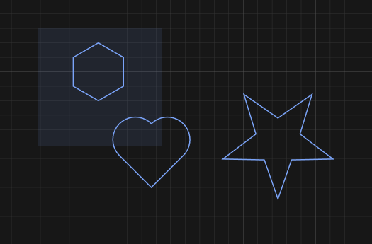
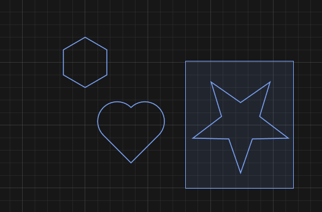
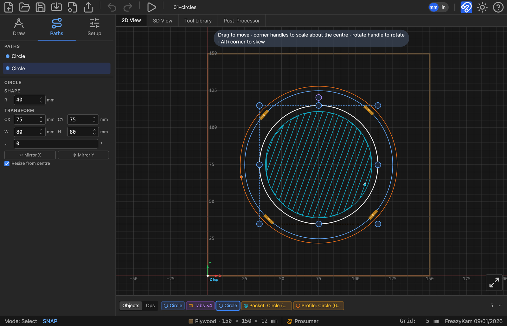
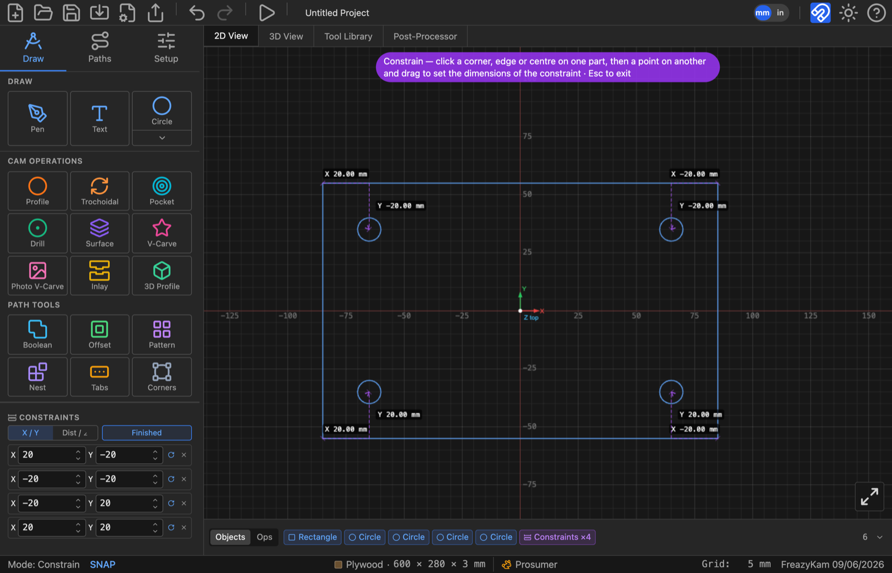
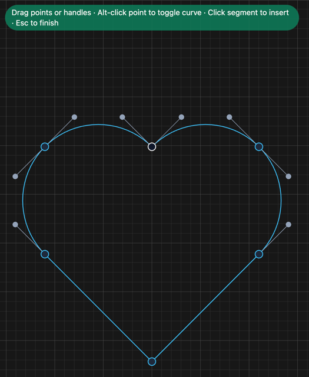
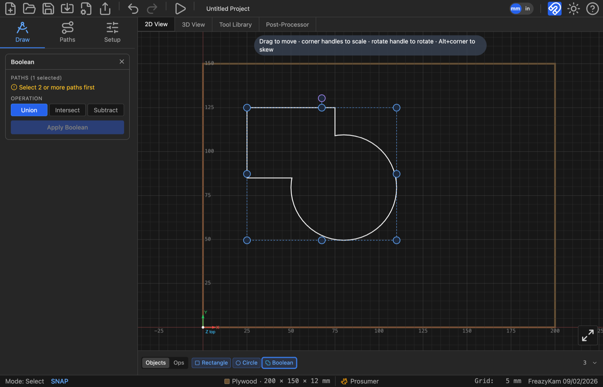
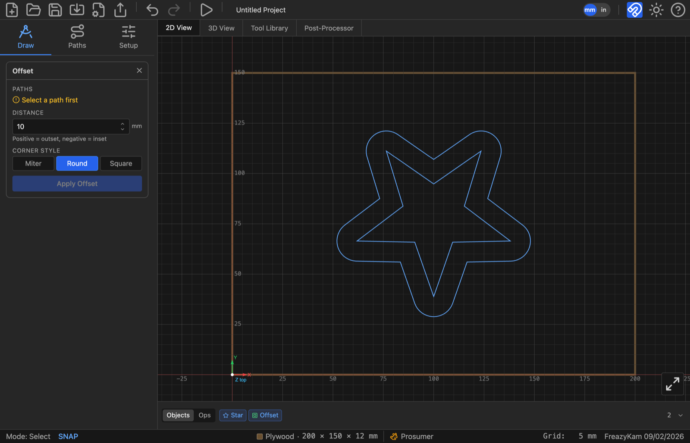
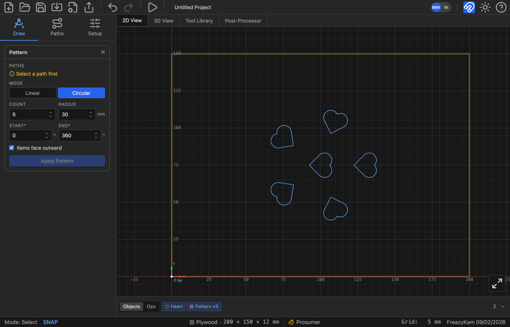
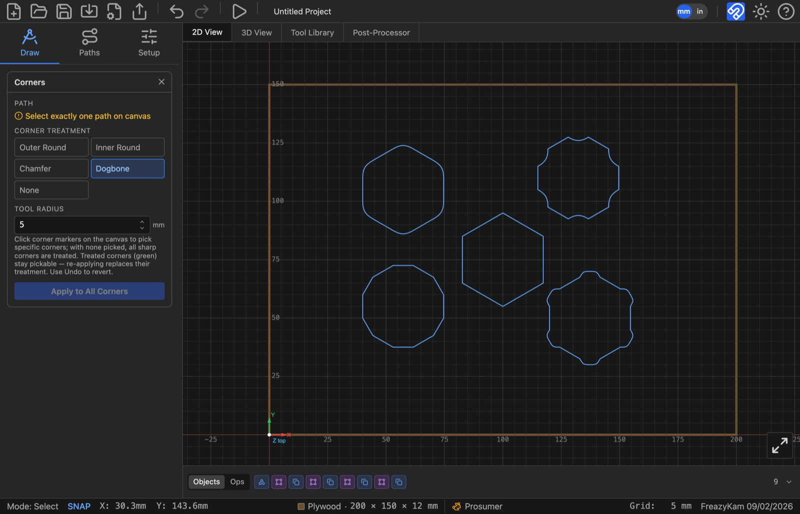

# 2. The canvas

Chapter 1 drew two circles by typing a radius and clicking. That is the easy case. This
chapter is about the rest: getting around a drawing, selecting exactly what you mean,
moving and sizing things precisely, drawing freehand, and reshaping a path point by
point.

Everything here happens in the **2D View**, and nothing here cuts anything — this is the
drawing half of the app. Cutting is chapter 4 onward.

---

## Getting around

| Action | How |
|---|---|
| Zoom | Scroll wheel, centred on the cursor |
| Pan | Middle-mouse drag, or hold **Space** and drag |
| Snap to grid | **S** toggles it — the status bar shows `SNAP` in blue when it's on |
| Units | The **mm / in** toggle in the toolbar |

The grid spacing is shown bottom-right, and the status bar along the bottom always
reports the current mode, the stock, and the machine rigidity — so if a click isn't doing
what you expect, look there first. `Mode: Select` means clicks select; `Mode: Circle`
means the next click places a circle.

The **mm / in** toggle changes only what you see and type. Millimetres are what the
project actually stores, so switching units never moves anything, never introduces
rounding, and a file saved by someone working in inches opens correctly for someone
working in mm.

---

## Selecting

Clicking is the obvious half. The part worth learning is the drag box, because it asks
one of two genuinely different questions and **the direction you drag chooses which**.

| Gesture | Selects |
|---|---|
| Click a path | That path — or the whole group it belongs to |
| Shift-click | Adds or removes one path from the selection |
| **Alt-click** | The single path *inside* a group, ignoring the group |
| Drag right → | Everything the box **touches** (dashed outline) |
| Drag ← left | Only what lies **wholly inside** it (solid outline) |
| Click empty canvas | Deselects |
| **Escape** | Deselects, or cancels whatever tool is armed |

The two box directions matter on a crowded drawing. *Everything this box runs across*
picks a row of parts out of a nest. *These, and nothing they overlap* picks one wheel out
from under the arbor crossing it. The outline tells you which you're about to get, and it
is the only thing on screen saying so:

| Dragged **right** → **dashed** box, takes what it touches | Dragged **left** ← **solid** box, takes only what's wholly inside |
|---|---|
|  |  |
| Catches the polygon **and** the heart — the box crosses it | Catches the star only |

<!-- CROP · identical framing from two 1× full-screen captures, 525 px wide. -->

The test is on each object's bounding box, not its outline — so an L-shaped path counts as
touched by a box sitting in the crook of its own bounding box.

An enclosing box treats a group as one object: a group half inside the box is not
selected at all, rather than coming back as the handful of its parts that happened to
fall inside.

### The Paths list

The sidebar's **Paths** tab lists everything in the project by name, which is the reliable
way to grab something small, something buried under something else, or one path inside a
group.

*Selecting a path in the list selects it on the canvas, and its properties appear
underneath.*

<!-- FULL APP · 1600 px wide. Paths tab, one of two circles selected. -->

---

## The Properties panel

Select something and the Properties panel appears under the paths list, in two sections
that answer two different questions:

- **Shape** — *what this thing is.* A circle's radius, a gear's module and tooth count, a
  star's point count. These are the parameters the object was generated from, and editing
  one regenerates the object.
- **Transform** — *where it is and how big.* Centre, width and height, rotation angle.
  These are absolute: type `75` into CX and the object's centre goes to X 75, it doesn't
  move by 75.

A path that came from an SVG or the pen tool has no Shape section — there are no
parameters to recover, only geometry — so it shows Transform alone.

Below them:

- **Mirror X** / **Mirror Y** flip the selection about its own centre.
- **Resize from centre** decides whether dragging a corner handle grows the object
  outward from its middle or from the opposite corner. It rides with the object, so you
  can change your mind later.

---

## Moving, scaling and rotating

Select something and handles appear around it.

| Handle | Does |
|---|---|
| Drag the object itself | Move |
| Corner handle | Scale — about the centre or the opposite corner, per **Resize from centre** |
| Edge handle | Scale in one axis only |
| The handle above the box | Rotate |
| **Alt** + corner handle | Skew (shear) instead of scale |

For anything that needs to be exact, type it into the Transform fields rather than
dragging. Dragging is for arranging; the fields are for dimensions.

> **Rotating or non-uniformly scaling a generated shape gives up its parameters.** A
> circle stretched into an oval can no longer be described by a radius, so its Shape
> section goes away and it becomes an ordinary path. Moving it, or scaling it evenly,
> keeps the parameters intact. If you want an ellipse, draw an ellipse.

**Gear, Escapement, Pendulum and Track refuse drag-scaling entirely** — they don't even
draw resize handles. Their size comes from module and tooth count, from the beat, or from
the piece they must connect to. Change those numbers in the Shape section instead.

---

## Groups

Select several paths and press **Ctrl+G** (or **Group** in the Properties panel) to tie
them together. After that, clicking any member selects the whole group, and they move,
scale, rotate and delete as one thing. The Objects strip shows them as a single chip.

- **Ctrl+Shift+G** ungroups.
- **Alt-click** reaches a single path inside a group without ungrouping.
- Groups nest. Group a group with a shape, and ungrouping once gives you back that group
  and that shape — one level at a time, not a pile of loose paths.

---

## Constraints

A group ties parts together rigidly. A **constraint** does something different: it holds
one part a stated distance from another, and keeps it there as either one is edited. Four
holes 10 mm in from the corners of a mounting plate stay 10 mm in from the corners when
the plate is resized — or turned.

### Making one

1. Press **C**, or **Constrain** in the Constraints section of the Properties panel.
2. Move over a part and its attachment points appear: a **square** at each corner, a
   **bar** at the middle of each edge, a **ring** at the centre, a **crosshair** at the
   centre of a round feature. The one a click would take turns amber.
3. Click a point on one part, then a point on another.

The constraint is created holding the distance the two parts **already** stand at, so
making one never moves anything — and the keyboard goes straight to its first number, so
you can type the figure you actually wanted without reaching for the mouse.

**Or drag the second part into place.** Instead of clicking the second point, press on it
and drag. The part moves with the dimension reading out live on the canvas, and letting go
creates the constraint holding wherever you dropped it. Grid snap, object snap and
**Shift** to lock an axis all work exactly as they do for an ordinary drag — so you can
dial an offset in by eye and then type the round number into the row.

The tool stays on, so a row of holes is two clicks each. **Escape** drops a half-made
constraint; **Escape** again — or **Finished** — leaves the tool.

*Four holes held 20 mm in from the corners of a plate. Each dimension draws as an L — the
X leg and the Y leg, each labelled beside its own leg — and each constraint is one line in
the panel. Resize the plate and the holes stay 20 in from the corners; the whole chain is
one chip in the Objects strip.*

<!-- FULL APP · 1600 px wide. Constrain tool active, four X/Y constraints on the plate. -->

### The row

One line per constraint, in the Constraints section:

| | |
|---|---|
| **X** and **Y**, or **Dist** and **∠** | The numbers being held. Type one and the second part moves. |
| the label itself | Click it to stop holding that number. The part is then free in that respect, and the greyed figure beside it goes on reporting what the parts currently stand at. Click again to hold it there. |
| **↻** | Hold the **angle between** the two parts as well, so the second turns when the first does. On by default. |
| **✕** | Delete the constraint. The parts stay where they are. |

**X / Y** or **Dist / ∠** is set by the toggle beside the Constrain button and applies to
the next constraint you make. X and Y is how a hole in the corner of a plate is
dimensioned; a distance and an angle is how a linkage, a bolt circle or a gear train is.

### Holding a part off the stock

Select a single part and the section offers **Left**, **Right**, **Bottom** and **Top**:
hold it where it now stands relative to that edge of the stock. The stock is **ground** —
nothing moves it, and a part pinned to an edge wins even over a drag, which is what makes
"20 mm in from the left, whatever else happens" mean what it says. An angle against an
edge means nothing (the point on the edge slides with the part), so a stock constraint
holds a distance only.

### What moves what

**There is no root.** Drag any part of a chain and the rest follow it — the solve starts
from whatever you just moved. Typing a number is the one case that has to pick a side: it
holds the first part and moves the second, and the arrowhead on the dimension line is what
says which is which.

The panel tells you the reach before you start: *"Dragging this moves 3 other parts with
it"*, and *"Held to the stock — it will not move."*

### Turned parts

Every number is measured in the **first part's own frame**, and every anchor is a corner
of that part's box measured the same way. So `X 10, Y 10` from a plate's top-right corner
means 10 mm in along each of *its* edges — rotate the plate and the holes go round with
it, still 10 in from the corners. The **↻** toggle carries that the last step: with it on,
the held part turns as well as moves, which is what a slot or a label needs and a round
hole does not care about.

Rotation only. Stretch the plate and a typed 10 mm is still 10 mm.

### When it refuses

> *Over-constrained in X: Plate, Hole 3 are held by more constraints than they have room
> to satisfy. Delete one.*

Two constraints fighting over the same freedom have no answer, so nothing is moved at all
— the rows involved turn red and the parts stay put. Delete one of them. A part can be
held off two different stock edges quite happily; what it cannot be is held to another
part *and* pinned to the stock in the same direction.

### Worth knowing

- **Dimensions are drawn on the canvas only while the Constrain tool is on**, and then
  exactly the ones the panel lists. Selecting a part to give it a toolpath does not cover
  the geometry in dimension lines.
- **Deleting a part deletes the constraints that named it**, in the same step — one undo
  brings back both.
- A constraint moves a **whole part**: a gear moves with its bore and spokes, a group
  moves as the group.
- Constraints are saved in the `.fkam` file.

---

## The pen tool

**Pen** in the Draw menu places points; the tool decides what curve runs through them.

- **Click** places a point.
- **Click-drag** in Bezier mode pulls out curve handles.
- **Alt-click** makes the incoming segment straight, whatever mode you're in.
- **Click near the first point** closes the path.
- **Escape** finishes it open — two points minimum.
- **Ctrl+Z** takes back the last point placed, without leaving the tool.

Five curve modes sit under the tool, and they change what the *same set of points* means:

| Mode | Gives you |
|---|---|
| **Linear** | Straight segments — a polyline |
| **Bezier** | Handles you pull out yourself; total control, most work |
| **C-Rom** | A smooth curve through every point, computed for you (the default) |
| **Spline** | A smoother cubic spline through every point |
| **Arc** | Fitted circular arcs — the one to use when the shape genuinely is arcs |

Except in Bezier mode you don't drag handles at all; you place points and the curve
follows. Change mode after the fact and the same points give a different path.

---

## Point editing

**Double-click any path** to edit it point by point. This works on anything — a pen path,
an imported SVG, a shape whose parameters you've given up.

| Action | Does |
|---|---|
| Drag an anchor | Moves the point and both its handles |
| Drag a handle | Reshapes the curve without moving the point |
| **Alt-click** a point | Toggles it between a corner and a curve |
| Click a segment | Inserts a new point there |
| Hover a point + **Delete** | Removes it — the point under the cursor turns red |
| **Escape**, or click away | Commits and exits |

*Anchors sit on the path; the grey dots on stalks are the Bezier handles that set the
curve into and out of each one. The first point is drawn in white, so you can always tell
where the path starts — which matters when you care where a cut begins. The banner names
the gestures, and the status bar reads `Mode: Edit Points` until you finish.*

<!-- CROP · canvas plus the hint banner, from a 2× capture, downscaled to 525 px wide to match the dragbox pair above. -->

**Ctrl+Z inside a point-edit session undoes just that session's edits**, one at a time,
before it starts eating anything else. You can go into a path, make a mess, back out of
it, and leave without having disturbed the rest of the project.

---

## Reshaping with Path Tools

The **Path Tools** row, in the CAM Operations panel, makes new geometry from existing
geometry rather than cutting anything. All five are re-editable afterwards from their chip
in the Objects strip — the chip holds the parameters, so you can change your mind rather
than undoing and redoing.

| Tool | Does | Needs |
|---|---|---|
| **Boolean** | Union, intersect, subtract | Two or more overlapping paths |
| **Offset** | Grows or shrinks a path by a distance, with round, miter or square corners | One or more paths |
| **Pattern** | Linear grid or circular array | One path or group |
| **Tabs** | Holding tabs on a profile cut — covered in [chapter 5](05-pockets.md#holding-tabs) | An existing profile operation |
| **Corners** | Applies a corner treatment to the corners you pick | One path |

### Boolean

Select two or more paths and pick **Union** (merge them), **Intersect** (keep only where
they overlap) or **Subtract** (cut the rest away from the first).

Selection order decides the result for Subtract, and it's *pick* order, not stacking
order: the path you clicked first is kept, the others are cut away from it. The form's
chips are labelled to match — **primary (kept)** for the first pick, **tool (cut away)**
for the rest — so you can see which way a subtract will go before applying it.

The result is a new path; the sources aren't deleted, only hidden, so nothing is lost if
you undo. Click the result's chip to reopen **Edit Boolean**, where you can swap the
operation — union to subtract, say — without re-picking the sources.

*Union highlighted, with the two source shapes still showing their own selection handles
on canvas.*

<!-- FULL APP · 1600 px wide. -->

### Offset

Select one or more paths and set a **distance** in mm — positive grows the path (outset),
negative shrinks it (inset) — and a **corner style**: **miter** (sharp corners, the
default), **round**, or **square**. Offsetting several paths at once applies the same
distance and style to each, producing one result per source, all editable together from
one chip.

Miter is tuned to keep genuinely sharp points sharp — a star or a gear tooth doesn't get
its tips squared off the way a naive miter limit would — while still capping anything
close to a spike. An inset larger than the shape collapses it to nothing, which the form
reports as an error rather than silently returning an empty path.

*A 10 mm Round outset. Round is the style that shows most clearly on a point — Miter
would carry the star's own corner out to a sharp tip instead.*

<!-- FULL APP · 1600 px wide. -->

### Pattern

Select one path (or a group) and choose **Linear** or **Circular**.

- **Linear** lays out a **Rows × Cols** grid at the given X and Y spacing. The original
  is row 0, column 0 of the grid and stays exactly where it is; the tool adds the rest
  around it.
- **Circular** arrays copies at a **radius** from the selection's own centre, over a
  **start/end angle** — 0–360 for a full ring, narrower for an arc. **Items face
  outward** rotates each copy tangentially, the way spokes point away from a hub, instead
  of every copy keeping the original's orientation.

A copy is the real shape it was copied from, not a flattened outline — a patterned gear
keeps its module and tooth count re-editable, and a patterned group stays one group per
copy rather than merging into the group being patterned. Reworking the count afterwards
reuses existing copies where it can, so anything already built on one of them (a drilled
hole, an assigned operation) keeps working; a copy deleted by hand stays deleted rather
than being resurrected by the next edit.

*Circular, count 5, radius 30 mm, a full 360° ring. With Items face outward checked, each
heart is rotated to point away from the centre rather than all five sharing the
original's orientation.*

<!-- FULL APP · 1600 px wide. -->

### Corners

**Corners** is the one worth knowing about before you need it. It offers **Outer Round**,
**Inner Round**, **Chamfer**, **Dogbone** and **None**, and you choose which corners get
it rather than treating them all.

**Dogbone** is the CNC-specific one. A round cutter cannot cut a sharp internal corner —
it leaves a radius, and a square peg then won't seat in the socket you just cut. A dogbone
overcuts a small circular notch into the corner so the mating part fits. Its radius field
asks for the **tool radius**, not a decorative size, because that is what decides how much
must be relieved.

*Dogbone at a 5 mm tool radius, applied to every corner. The status bar's cursor readout
is from picking specific corners — leave none picked and Apply treats every sharp corner
on the path.*

<!-- FULL APP · 1600 px wide. -->

---

## Next

- **[3. Stock, origin and tools](03-stock-and-tools.md)** — the tool library, feeds and speeds
- **[4. Operations](04-operations.md)** — turning geometry into toolpaths
