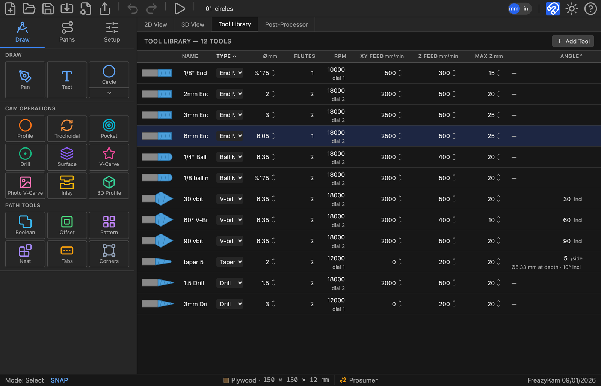

# 3. Stock, origin and tools

Two things have to be true before a toolpath means anything: the app has to know what is
on your table, and it has to know what is in your spindle. Get these right once at the
start of a project and everything downstream — depths, the simulation, the feeds, the
warnings at export — follows from them.

---

## Setup: the stock

**Setup** is the third tab in the sidebar. It fills the panel and leaves the view
visible, so edits show up live.

### Dimensions

**Width (X)**, **Height (Y)** and **Thickness (Z)** are the actual piece of material.
Thickness is the one that does real work: a profile cut to 12 mm through 12 mm stock is
what separates the part, and the simulation carves a block of exactly this depth.

### Work origin

Two separate questions, and both matter more than they look.

**X0 Y0** is the nine-position grid — which corner or edge of the stock the machine's
zero corresponds to. **Bottom left** is the default and is what most hobby machines get
jogged to. Pick centre if you locate work from the middle, which is common with a
fixture or a rotary axis.

**Z0** is where the tool's zero height is:

| Setting | Means | Zero the bit against |
|---|---|---|
| **Top of stock** (default) | Z0 is the surface; all cuts are negative | The top of the material |
| **Bottom of stock** | Z0 is the spoilboard; the surface is at +thickness | The table or spoilboard |

Top of stock is the usual choice — you touch off on the workpiece with a piece of paper
or a Z-probe and go. Bottom of stock suits work where the material thickness varies but
the finished depth from the table must not, such as surfacing a slab.

Whichever you choose, **the export review restates it back to you** before the file is
written. Read that line against how you actually zeroed the machine. Getting this wrong
is the fastest way to plunge a cutter through a spoilboard.

### Material

The material is not decoration. Each has a **hardness factor** that drives the automatic
feeds and speeds:

| Softer ← | | | | → Harder |
|---|---|---|---|---|
| Cedar 0.5 · Pine 0.6 | HDPE 0.7 · MDF 0.8 · Plywood 0.9 | Walnut 1.1 · Cherry 1.2 | Maple 1.3 · Oak 1.4 | Aluminum 2.5 · Brass 2.8 |

Aluminium and brass additionally carry a **maximum surface speed**, because the failure
mode in metal is not a broken cutter but a bit that overheats and welds swarf to its own
edge. If your spindle cannot run slow enough to respect it, the export review says so.

---

## The tool library

The **Tool Library** tab across the top holds your cutters. It is saved with the project
*and* kept in the browser between sessions, so a new project starts with the tools you
already own.

<!-- FULL APP · 1600 px wide. Tool Library tab, default library. -->

Each row is one cutter. The little picture at the left is drawn from that tool's own
numbers, so a taper really does taper and a V-bit really does come to a point — a quick
check that a row says what you meant.

| Column | Means |
|---|---|
| **Name** | Yours to choose. Name them the way you'd reach for them in the shop |
| **Type** | End Mill, Ball Nose, V-bit, Taper End Mill, Drill — this decides which operations offer it |
| **Ø** | Cutting diameter — **except on a taper**, where it is the *tip* diameter |
| **Flutes** | With RPM and feed, this sets chip load |
| **RPM** | Spindle speed, with the router dial equivalent beneath it |
| **XY Feed** | Cutting feed |
| **Z Feed** | Plunge feed — always slower; a cutter plunging is cutting with its worst geometry |
| **Max Z** | Deepest this tool may cut, i.e. its usable flute length |
| **Angle** | V-bits: **included**. Tapers: **per side**. Blank for everything else |

### Type decides where a tool can be used

| Tool | Offered to |
|---|---|
| End mill | Profile, Pocket, Trochoidal, Surface, Inlay, helical drilling |
| Ball nose | Profile, Pocket, Trochoidal, 3D Profile |
| V-bit | V-Carve, Photo V-Carve, Inlay walls, Profile |
| Taper end mill | V-Carve, Inlay walls, 3D Profile, Profile |
| Drill | Peck drilling |

If a cutter you expected isn't in an operation's list, it is the wrong **type** for that
operation. Max Z does not hide a tool — ask for more depth than it has and the depth
field warns *Exceeds tool Max Z*, leaving the decision to you.

### The two angle conventions

This trips people up because the trade itself is inconsistent, and the library follows
the trade rather than tidying it up:

- A **V-bit's** angle is the **included** angle — the whole opening. A 60° V-bit has 30°
  on each side of the axis.
- A **taper end mill's** angle is **per side**, which is how the bits are sold.

And a taper's diameter column is its **tip**, not what it cuts. The library works out the
rest for you: the shot above shows a 5°/side taper on a 2 mm tip, annotated *Ø5.33 mm at
depth · 10° incl*. That is the real cutting diameter at its usable length, and the
included angle for comparison against a V-bit.

The practical difference is at the bottom of a cut. A taper's tip is a small ball, so it
can enter a groove narrower than itself and leave a round-bottomed cut instead of refusing
the job — which is what makes it good for fine lettering and 3D finishing. A V-bit comes
to a true point and closes tighter, which is why an inlay still wants one: a taper's
rounded foot leaves a hairline gap at the finished face.

---

## Feeds and speeds

The bottom of the Setup panel decides how hard the machine is driven. **Auto Feeds &
Speeds** is on by default, and it is the right default: it computes a feed, plunge feed,
spindle speed and step-down per operation, from the tool, the material and your machine.

### Machine rigidity

The single most useful number here. It scales both how hard the app drives the chip and
how deep a pass it takes:

| | Level | Suits |
|---|---|---|
| 🐌 | 1 · Hobby | Light rail or 3D-printed frames, belt drive, small routers |
| 🐢 | 2 · Light hobby | An entry aluminium-extrusion machine |
| 🐇 | 3 · Prosumer | A stiff hobby machine — the default |
| ⚡ | 4 · Heavy | Steel frame, ballscrews, a real spindle |
| 🚀 | 5 · Commercial | Industrial machine |

Set it honestly. Too high and a flexy gantry chatters, deflects and leaves a wandering
wall; too low and you spend hours cutting air-light passes. The status bar shows the icon
at all times so an over-ambitious setting reads "hot" at a glance.

### Spindle

Set the **min and max RPM** to what your spindle can actually do — routers bottom out
around 10 000. Auto mode picks a speed inside that range.

Then pick your **spindle type**. If you run a trim router rather than a VFD spindle, this
is worth setting: the app knows the published speed charts for the **DeWalt DW6xx /
DWP611** and the **Makita RT07 / RT0701C**, and translates every RPM into **the dial
number you actually turn** — `dial 2`, `dial 2.5` — shown in the tool table, the
simulation and the G-code comments. G-code `S18000` is no use if your router has no idea
what an S-word is.

### Max feed rate

A hard ceiling, in mm/min. Set it to what your machine can move without losing steps, and
the app will not exceed it.

This one has a consequence worth understanding. Chip load is feed ÷ (RPM × flutes), and
it does **not** depend on how deep the pass is. So when the machine cannot feed fast
enough to reach a sensible chip load, the correct fix is to **slow the spindle down**, not
to take a shallower cut — and that is what the app does. A bit that is fed too slowly for
its speed doesn't cut; it rubs, heats and dulls.

### The chip-load gauge

Whether the numbers are right is answered while the simulation runs, in the readout under
the stock:

| Reading | Ratio to target | Means |
|---|---|---|
| 🔴 **rubbing · too hot** | below 0.75 | Feed too slow for the RPM — the edge rubs instead of cutting |
| 🟢 **sweet spot** | 0.75 – 1.4 | Where you want to be |
| 🔵 **chips too large** | above 1.4 | Feed too fast for the RPM — risk of breaking the cutter |

On manual feeds the app also suggests the feed that would put you back in the band. This
is the honest check on everything in this chapter: set the stock, set the tools, then
watch the gauge on a simulated run before you cut anything.

> The model produces **sane starting numbers, not shop-certified values.** It knows your
> tool, your material and how stiff you said your machine is; it does not know your
> cutter is dull, your stock is a knotty board, or your workholding is a bit optimistic.
> Treat its output the way you'd treat a manufacturer's chart — a place to start.

---

## Next

- **[4. Operations](04-operations.md)** — turning geometry into toolpaths
- **[5. Profiles and pockets](05-pockets.md)** — cut side, tabs, and the five pocket strategies
