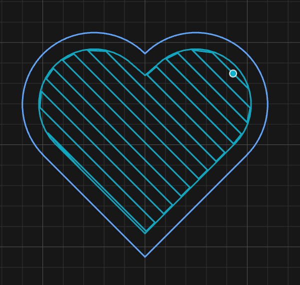
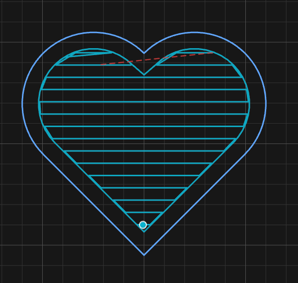
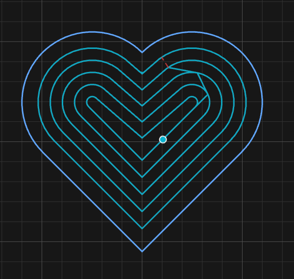
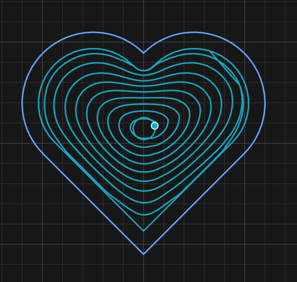
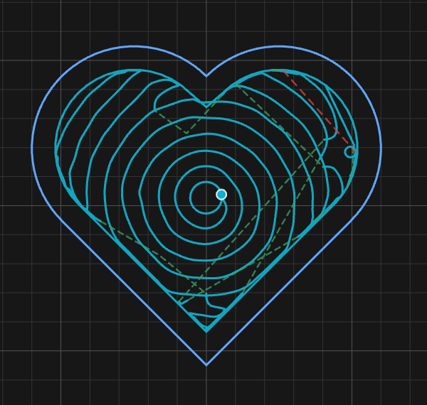

# 5. Cutting with an end mill

Five operations cut with a flat or ball-nosed cutter: **Profile** follows a line,
**Pocket** clears an area, **Trochoidal** cuts a slot at low load, **Drill** makes holes,
and **Surface** flattens the stock. Between them they cover most of what a router
actually does.

---

## Profile

A profile follows a path. The only question that really matters is **which side of the
line the tool runs on**, because that is what decides whether your part comes out the
size you drew it.

| Cut side | Tool runs | Use for |
|---|---|---|
| **Outside** | Outside the line, offset by its radius | The outline of a part — the line is the finished edge |
| **Inside** | Inside the line, offset by its radius | A hole or window — the line is the finished wall |
| **Centerline** | Axis straight down the line | A groove or a score — takes half a tool width off each side |

Getting this wrong is the classic beginner's mistake: a part cut *centerline* instead of
*outside* comes out one tool radius undersized all round, and the error is invisible on
the canvas.

Other fields:

- **Stock allowance** leaves material on the wall for a finishing pass. **Negative cuts
  past the line**, which is how you get a slip fit rather than a press fit.
- **Ramp in** enters each pass on a slope instead of plunging. Leave it on unless you
  have a reason.
- **Direction** — climb for a clean edge on a rigid enough machine, conventional if the
  machine has backlash it can't take up.

> **The tool's radius changes with depth.** With a V-bit or a taper the wall is not
> vertical, so the offset is taken at the *cut surface* — the finished wall touches your
> line at the start height and tapers below it. With an end mill this is a distinction
> without a difference; with a taper it is the whole story.

### Open paths

A profile of an open stroke is cut **centerline** — that is the only reading that means
anything, since a line with no inside has no side to offset to. Ask for inside or outside
on an open path and the operation refuses and says so, naming the side you chose.

This refusal matters more than it sounds. Without it, an open U-shaped path handed to an
area operation gets silently treated as closed — joined mouth to mouth — and the machine
cuts a shape you never drew, with a toolpath that looks perfectly reasonable on screen.

---

## Holding tabs

Tabs are small bridges of uncut material that stop a part coming loose on the final pass
and being thrown by the cutter.

**Tabs** is a Path Tool, not an operation. It attaches to the **path**, gets its own chip
in the Objects strip, and any profile cut on that path honours it.

| Field | Meaning |
|---|---|
| **Count** | How many, spaced evenly around the path |
| **Length** | How far along the path each one runs |
| **Height** | How much material is left under the cutter |

Drag any tab along the path to move it. Put them on straight runs rather than corners,
away from anything delicate, and where you don't mind cleaning up — the tab has to be
cut or sanded off afterwards.

Height is a trade: enough to hold the part through the last pass, little enough to part
with a chisel. Two to three millimetres suits most wood.

---

## Pocket

A pocket clears the area **inside** a closed boundary. Anything closed that sits inside
the boundary is read as an **island** and left standing — you don't declare islands, the
app reads them off the geometry.

### Invert Pocket

Nested outlines have two valid readings, and only you know which is the part. A ring
drawn as two circles is either *clear the annulus and leave the middle*, or *clear the
middle and leave the ring*. When the selection nests, an **Invert Pocket** checkbox
appears to say which.

The operation stores the reading it used, so reopening the form shows what that pocket
actually did rather than guessing again.

### The five strategies

The same heart pocket, cut five ways with the same tool and stepover:

| Auto | Raster | Contour | Morph | Adaptive |
|:---:|:---:|:---:|:---:|:---:|
|  |  |  |  |  |
| Rastered, plus a contour round the wall | One angle, straight across | Nested rings | One unbroken spiral | Constant engagement |

<!-- CROP · identical box over the same heart pocket in five captures, 600 px wide each. -->

Look at what each one does to the *corner* of the heart — that notch is where they differ
most, and it is the part of a pocket that decides whether you get a clean floor.

| Strategy | How it clears | Best for |
|---|---|---|
| **Auto** | Picks per area — rasters open ground, contours around islands, adaptive on the junctions | **Start here.** Mixed pockets, anything with islands |
| **Raster** | Straight parallel passes at one angle | Simple open pockets with nothing in the way |
| **Contour** | Concentric offsets following the boundary inward | Walls and islands that must be traced |
| **Morph** | One continuous spiral morphed between the boundary and the interior | Smooth organic shapes, fewest retracts |
| **Adaptive** | Holds a constant tool engagement | Hard material and deep pockets — heavier depth of cut at lower load |

**Contour and Morph look alike and are not.** Contour cuts a stack of separate closed
rings, lifting between them. Morph is *one continuous path* that spirals from the wall to
the middle without lifting at all — which is why it has the fewest retracts and why it
can't always be done.

**Auto is the default and usually the right answer.** The others are there for when you
know something about the shape that the general case doesn't.

**A strategy can decline a shape.** Morph in particular only suits some geometry. When it
declines, Auto generates the pocket instead and the form tells you so — *"morph declined
this shape, so auto generated it instead."* You can **Alt-click Generate** to force it,
and if it declines even then, the message says so rather than sending you round the loop
again.

### Stepover, engagement, and angle

**Stepover** is how far each pass moves over, as a percentage of tool diameter. On the
**Adaptive** strategy the same slider becomes **Engagement**, because that strategy holds
engagement constant rather than spacing.

**Angle** applies to raster passes. Left on **Auto (longest passes per area)** the app
picks the direction that gives the fewest, longest passes — fewer turns, less air. Untick
it to pin an angle, which is what you want when the grain, or a wall you care about,
says so.

### Rest clearing

Every pocket gets a **rest-clearing pass**. Whatever a strategy's passes couldn't reach
is cut after them and before the wall pass, so it comes off as a light skim rather than
being hit at full width on the wall pass. You don't configure it; it's there because
every strategy leaves *something* somewhere.

---

## Trochoidal

Trochoidal cutting takes a slot at low load by moving the cutter in overlapping loops
along the path instead of ploughing straight down it. The full width still gets cut, but
the tool is only ever engaged over a small arc. Use it in hard material, on a light
machine, or wherever a full-width slot would be too much.

| Field | Meaning |
|---|---|
| **Cut side** | Inside, outside, or centerline |
| **Loop amplitude** | How far the loops swing either side |
| **Step / loop** | How far along the path each loop advances |
| **Finishing pass** | A clean-up pass after the loops |

**Centerline trochoidal is the one to understand.** It follows an **open** stroke — the
only operation that genuinely does — and the slot is **centred on the line you drew**.
The loops swing half the amplitude each way, so the finished slot comes out:

```
slot width = 2 × loop amplitude + tool diameter
```

Draw a line, ask for a 2 mm amplitude with a 6 mm cutter, and you get a 10 mm slot
centred on that line. Size the amplitude from the slot you want, not from the tool.

On a centerline cut the **finishing pass is the two walls, not the centreline** — the
loops already clear right across the middle, so a sweep down it would be a pure air pass.
It is the walls that are left scalloped, and it is the walls that get cleaned up.

---

## Drill

Two modes, and they use different tools.

### Peck

Plunges down the axis, retracting to clear chips. Points come from either:

- **Clicking on the canvas** to place them by hand, or
- **Selecting circles** — every circle in the selection is drilled at its centre.

The second is the everyday case: import a drawing, select the hole circles, drill them.
Pick order is drill order.

### Helical

Cuts a hole with an **end mill** by spiralling down it, rather than plunging. Takes its
diameter from a circular path, which means it can make a hole no drill in your library
matches — and it clears chips as it goes.

> **Drilling measures depth from the surface it starts on**, like every other operation.
> For a 5 mm deep hole in the floor of a 3 mm pocket, set the start to that pocket's floor
> and the depth to `5` — the field is the depth of the hole itself. The bottom of that hole
> ends up **8 mm below the top of the stock**, which is the number to check against your
> stock thickness.

---

## Surface

Facing passes across the whole stock, to flatten a slab or true up the top before the
real work starts. Two settings — **stepover** and **angle** — and it covers the whole
workpiece rather than a path you select.

Use a large flat cutter, take a light cut, and remember the result is only as flat as
your machine is trammed.

---

## Next

- **[6. V-carving and inlay](06-vcarve-inlay.md)** — depth from geometry, and getting an inlay to seat
- **[9. Nesting](09-nesting.md)** — packing parts onto a sheet
