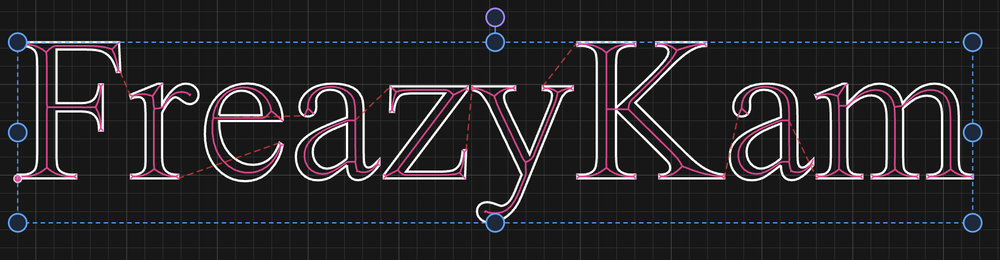
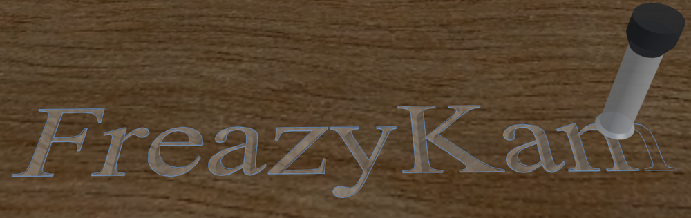
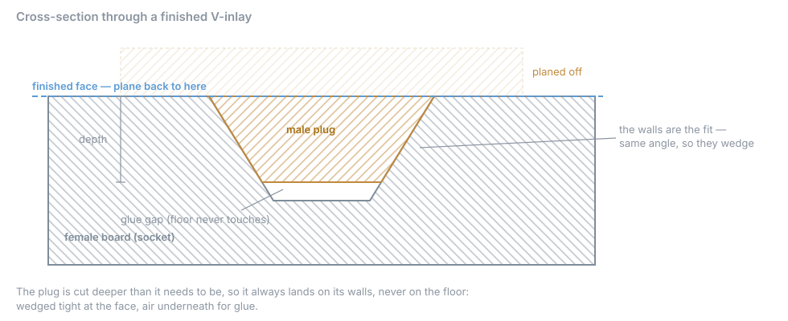

# 6. V-carving and inlay

Three operations cut with a pointed tool, and all three work the same way underneath:
**how wide the cut is decides how deep it goes.** A V-bit at the surface cuts wide; the
same bit deeper cuts narrower. Every operation in this chapter is an application of that
one fact.

---

## V-Carve

A V-carve makes letters and shapes look carved rather than routed. Instead of a
constant-depth pocket with vertical walls, the tool dives where the shape is wide and
lifts where it narrows — so a serif tapers to nothing and a corner comes to a crisp
point, exactly the way a hand-cut letter does.

Select closed geometry, pick a V-bit or a taper, set **Max Depth**, and generate. There
is no stepover and no strategy: the shape's own width decides the path.

*The toolpath runs down the middle of each stroke, following its centreline. Where a
stroke is wide the tool goes deep; where it narrows to a serif it lifts to nothing.*

*The same job simulated. The letters have sloped walls and the serifs come to a point —
neither of which a flat cutter can produce.*

<!-- CROP · lettering region from two 2× captures, 1000 px wide each. -->

**Max Depth** is a limit, not a target. Most of a carve never reaches it; it stops the
tool bottoming out in the widest parts of a broad shape. If your letters come out looking
flat-bottomed and blunt, that limit is what you're hitting.

The form tells you the consequence of the number you typed — *"cuts at most 4.00 mm wide
at full depth"* for a 90° bit at 2 mm. That is the width-to-depth law stated for your
tool, and it is worth reading before you commit: if the widest part of your lettering is
narrower than that figure, nothing in the job will ever reach Max Depth at all.

Holes and counters work without being declared. The bowl of an *o*, the triangle in an
*A*, an island inside a shape — the app reads them off the geometry, the same as a
pocket does.

### Which bit

| | Cuts | Bottom of the groove |
|---|---|---|
| **V-bit** | A true point | Comes to a sharp vee |
| **Taper end mill** | A small ball ground onto a cone | Rounded |

A taper's ball tip means it can **enter a stroke narrower than itself** and leave a
round-bottomed groove instead of refusing the job, which is what makes it good for fine
lettering and small detail. A V-bit closes to a true point and is the sharper result.

Remember the two conventions from [chapter 3](03-stock-and-tools.md#the-two-angle-conventions):
a V-bit's angle is **included**, a taper's is **per side**.

---

## Photo V-Carve

Rasters a photograph as a field of V-grooves whose depth follows image brightness. Dark
areas cut deeper, and because a deeper cut with a V-bit is a *wider* cut, the dark parts
of the picture become broad grooves and the light parts fine ones. Flood the finished
board with paint and sand the face back and the image appears in the grooves.

V-bits only — the effect depends on the width-to-depth relationship of a true cone.

| Field | Meaning |
|---|---|
| **Image** | The source photograph |
| **Angle** | Direction the groove lines run |
| **Depth at white** | How deep the lightest parts cut |
| **Depth at black** | How deep the darkest parts cut |

### Depth is the resolution control

This is the part that isn't obvious. **Line spacing is not a setting** — it is the width
of the deepest groove, so that the darkest lines just touch and nothing is cut twice. So
the depth range you choose decides how many lines there are:

- **A shallower carve is a finer one** — narrower grooves, more lines, more detail, less
  contrast.
- **A deeper carve has more contrast and fewer, wider lines.**

The form shows the resulting groove width range and line count as you change the depths,
so you can trade the two off directly rather than guessing.

---

## Inlay

An inlay fits a plug of one wood into a socket cut in another, so tightly that the seam
disappears. It is two operations on two boards, and the geometry that makes it work is
worth understanding before you cut anything.

### Why V-walls

If you cut a socket with straight walls and a plug to match, the plug has to be *exactly*
the size of the hole. A thousandth too big and it won't go in; a thousandth too small and
you have a visible line all round.

Cut both with the **same V angle** and the problem goes away. The plug is a wedge, the
socket is a matching wedge, and the plug simply descends until the two wall angles meet.
Where it stops is where the fit is tight — so you make the plug deliberately *too deep*,
guaranteeing it lands on its walls and never on the floor.

Three consequences follow from that picture, and they explain every field in the form:

1. **The walls are the joint.** They must be cut with the same tool angle on both halves.
2. **The floor must never touch** — that is the **Glue Gap**, and it is what gives the
   glue somewhere to go instead of holding the joint open.
3. **The face is made by planing**, not by machining. You press the plug in, let the glue
   cure, and plane or sand the assembly back to the female board's face. The seam closes
   as you approach it.

### The form

You generate the two halves **separately**, from the same drawing:

| | Cuts |
|---|---|
| **Female** | The socket — a pocket for the bulk, then V-carved walls |
| **Male** | The plug — a V-carved bevel, then a profile cutout |

| Field | What it does |
|---|---|
| **Roughing tool** | End mill that clears the bulk |
| **Finishing tool** | V-bit or taper that cuts the walls — **the same on both halves** |
| **Inlay depth** | How deep the socket goes |
| **Glue gap** | Air left under the plug |
| **Clearance** | Slack around the plug so it isn't a press fit |
| **Invert** | Which half of a nested drawing is the plug |
| **Mirror** | Male only — see below |

**Invert** answers the same question as Invert Pocket: a design inside a field can be read
two ways, and only you know which wood is meant to show. The form says which reading it is
using in plain words — *"the inner shapes are the plug"* versus *"the field around the
inner shapes is the plug"* — so you can check it rather than infer it.

**Mirror** matters because the male board gets **flipped over** to go in. If your inlay
has any handedness — lettering, a signature, anything not symmetrical — the plug must be
machined as a mirror image or it will read backwards in the finished piece. Cutting a
mirrored inlay the wrong way round is the mistake that costs a board.

### Use a V-bit, not a taper

A cone is its own mirror image, so a V-bit plug and its socket close completely.

A taper cannot. Its ball rounds the foot of the plug wall — the plug's *widest* end —
while the socket's rounding sits at its *narrowest*, the deep end. Flip them together and
those two roundings don't meet at the finished face. The result is a hairline gap right
where you'll be looking at it, up to the tip radius wide: about 0.20 mm for a 0.25 mm tip,
0.30 mm for a 0.5 mm tip.

The angle makes no difference — a taper at 20° and at 60° gives the same gap. The plug
still *seats* perfectly well; it just leaves a visible line. The form says so on the tool
row.

> **This is geometry, not a defect.** If you want a taper's fine detail somewhere, use it
> for the V-carving in [that](#v-carve) chapter section and keep a V-bit for inlay walls.

---

## Next

- **[7. 3D work](07-3d.md)** — machining an STL surface
- **[10. Simulating and exporting](10-export.md)** — checking a job before you cut it
