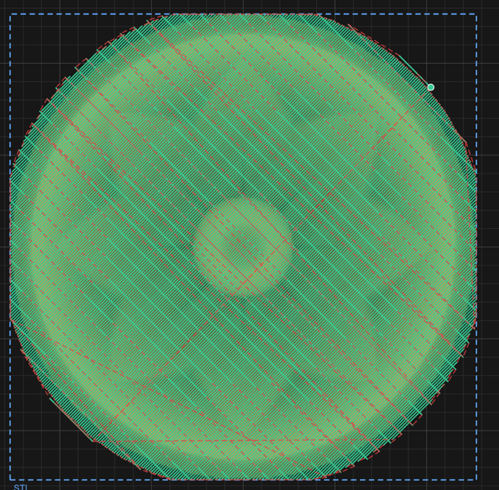
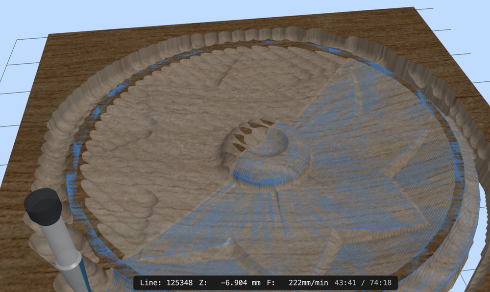

# 7. 3D work

Everything so far has cut 2D geometry to a depth. **3D Profile** is different: it follows
a surface, taking its shape from an imported STL mesh and sweeping a round-nosed cutter
back and forth across it until the wood matches the model.

This is how you carve a relief — a sign with a raised crest, a topographic map, a face,
anything modelled elsewhere.

---

## Importing an STL

**Import File** in the toolbar takes `.stl` in both binary and ASCII form. Drag-and-drop
onto the canvas works too.

What appears on the canvas is a **rectangle**, not a mesh — the model's XY footprint at
its true size, placed in the middle of the stock. The mesh itself rides along with that
rectangle; the rectangle is the handle you use to place and size the carve.

Switch to the **3D View** to see the actual model.

### Placing and sizing it

Move and scale the rectangle like any other object ([chapter 2](02-canvas.md#moving-scaling-and-rotating)).
Two things about how that maps onto the carve:

**The top of the model becomes the top of the stock.** The mesh's highest point is placed
at Z 0 and everything else hangs below it, so the whole relief cuts *into* the board. You
don't position it in Z; you decide how deep you'll let it go.

**Depth scales with the average of the X and Y scaling.** Scale the rectangle uniformly
and the relief keeps its proportions — twice as wide is twice as deep. Scale it
non-uniformly and the height is scaled by the mean of the two, which will not match either
axis, so a stretched model is a distorted one. If you care about the proportions, scale
uniformly.

> An STL is a **surface**, and this operation carves it from directly above. Undercuts —
> anything that overhangs itself — cannot be machined on three axes, and the carve simply
> takes the highest surface at each point. Model accordingly.

---

## The 3D Profile operation

Select the STL's rectangle and choose **3D Profile**. The form has two halves.

### Finishing — the pass that makes the surface

| Field | What it does |
|---|---|
| **Tool** | **Ball nose or taper only.** A flat cutter cannot follow a curved surface |
| **Stepover (XY)** | Spacing between passes, as a percentage of tool diameter |
| **Angle** | Which way the raster lines run, −90° to +90° |
| **Max Depth** | How far below the stock top the cut may go |

**Stepover is the finish quality control, and it is the expensive one.** The cutter is
round, so between two adjacent passes it leaves a ridge — a *scallop*. Halving the
stepover halves the scallop height and doubles the number of passes, and 3D finishing
passes are long to begin with. A small ball nose at a fine stepover can run for hours.

> **On a taper, stepover is a percentage of the tip, not of the cutting diameter.** A 30%
> stepover on a 2 mm tip is 0.6 mm — the form spells the millimetres out beside the
> percentage, which is the number to judge.

Pick the **angle** to run the passes along the length of the detail rather than across
it — a face reads better rastered vertically, a long ridge along its own axis.

### Roughing — the pass that saves the finishing cutter

Optional but almost always worth it. Without it, the finishing tool has to remove
everything, taking full-depth cuts with a small round bit — slow, and hard on the cutter.

| Field | What it does |
|---|---|
| **Roughing tool** | A **ball nose**, usually a bigger one. *None* gives a single-pass job |
| **Roughing stepover** | Wider than the finishing stepover — this pass is for volume, not finish |
| **Roughing step down** | Axial depth per level |
| **Roughing angle** | Defaults to 90° from the finishing angle, so the finish pass crosses the roughing marks |
| **Stock allowance** | Material left for the finishing pass — 0.3 mm by default |

The finishing pass is **rest-machined**: it knows what roughing already removed and only
cuts what's left, so it doesn't waste time cutting air over ground that's already clear.

*Both passes drawn together. Finishing is set to 45°, so roughing defaults to 135° and the
two cross at a right angle — finishing across the roughing grooves cuts a more even chip
than following them.*

<!-- CROP · canvas region from a 2× capture, downscaled to 714 px wide (capped at 700 px tall). -->

---

## Checking it

The **3D View** is not optional on this kind of job. A relief has no outline to sanity-check
on the 2D canvas; the toolpath is thousands of near-identical passes and reading it tells
you nothing.

*Part way through a relief. The ridges around the rim are roughing scallops the finishing
pass hasn't reached yet — and the clock says 43:41 of 74:18.*

<!-- CROP · canvas region from a 2× capture, 1000 px wide. -->

Simulate, then look at the carved surface. What you are checking for:

- **Scalloping** you can see in the render will be there in the wood.
- **Flat spots** where the tool was too big to reach into a hollow. A ball nose cannot cut
  a valley tighter than its own radius, and the simulation shows exactly that.
- **A relief that bottoms out**, meaning Max Depth clipped the model rather than the model
  fitting the board.

And check the estimated run time in the export review before committing. 3D finishing is
where a job quietly turns into an overnight one.

---

## Next

- **[8. Parametric parts](08-parts.md)** — gears, clocks, track and cutting boards
- **[10. Simulating and exporting](10-export.md)** — the review before you cut
