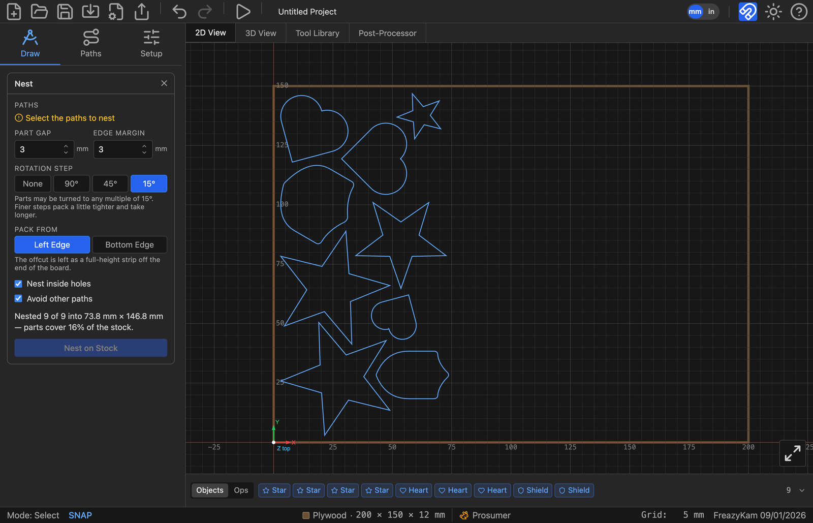

# 9. Nesting

**Nest** packs the selected parts onto the stock so the least material is wasted. It is a
Path Tool, not an operation — it moves your geometry and generates no toolpath.

The goal is not only to fit everything on. It is to leave **what's left over as one
usable piece**, rather than as scraps between parts.

---

## Using it

Select the parts, open **Nest** from Path Tools, set the options, and press **Nest on
Stock**.

*Nine parts packed from the left edge. The report reads "Nested 9 of 9 into 73.8 mm ×
146.8 mm — parts cover 16% of the stock", and what's left is a full-height strip you can
put back on the rack.*

<!-- FULL APP · 1600 px wide, downscaled from a 2× capture. -->

Anything that won't fit is **parked clear of the stock** rather than silently dropped, so
you can see what didn't make it and decide what to do.

---

## The settings

| Setting | What it does |
|---|---|
| **Part Gap** | Space between parts. At minimum, leave room for the cutter plus tabs |
| **Edge Margin** | Space kept clear at the edge of the stock — for clamps, and for the fact that the edge of a board is rarely straight |
| **Rotation Step** | How freely parts may be turned |
| **Pack From** | Which edge parts pile against, and therefore what shape the offcut is |
| **Fill stock with copies** | Repeat a single part until no more fit |
| **Nest inside holes** | Let small parts sit in the holes of larger ones |
| **Avoid other paths** | Treat unselected paths as ground already taken |

### Rotation Step is a step, not a limit

This is the one that looks broken if you misread it. **45° does not mean "up to 45°"** —
it means parts may be turned to any *multiple* of 45°, so a half turn is allowed. And 15°
allows everything 45° does, plus more.

| Setting | Use when |
|---|---|
| **None** | The stock has a grain to follow, or the parts are veneer-faced. Parts stay as drawn |
| **90°** | Sheet goods where you still want a tidy, square layout |
| **45°** | A reasonable compromise |
| **15°** | Tightest packing. Slowest to compute |

Finer steps pack a little tighter and take longer. On plywood or MDF there is no reason
not to use 15°; on anything where the grain shows, use **None** and accept the waste.

### Pack From decides the shape of the offcut

Both options waste the same *area*. They differ in what shape it's in, and that is what
decides whether it's stock or scrap:

- **Left Edge** — the offcut is a **full-height strip off the end of the board**.
- **Bottom Edge** — the offcut is a **full-width band along the top**.

Pick whichever leaves a piece you'd actually use. A long narrow strip is useful for rails
and edging; a wide shallow band suits panels.

### Nest inside holes

Lets a small part drop into the middle of a ring or a large opening. It saves material,
with one consequence stated plainly: **the offcut comes out in pieces.** You are trading
the one-usable-piece goal for raw yield. Worth it on expensive stock, often not worth it
on plywood.

### Avoid other paths

Treats paths you *didn't* select as ground already taken. This is how you add parts to a
board that already has work laid out on it — select only the new parts, tick this, and
they will pack into the space that's left rather than on top of what's there.

### Fill stock with copies

Available when exactly one part is selected. Repeats it until no more fit, at the same
gaps. **Each copy is an object in its own right** — cut it, move it or delete it like any
other, and the report tells you how many were added.

---

## Reading the report

After a nest, the form reports what happened:

> Nested 9 of 9 into 73.8 mm × 146.8 mm — parts cover 16% of the stock.

- **"9 of 9"** — everything fitted. A smaller first number means some parts were parked
  off the stock.
- **The dimensions** are the bounding box the parts actually occupy, which tells you how
  much board you'd need if you cut this layout from a smaller piece.
- **The percentage** is coverage, not efficiency. Awkward shapes cover a low percentage
  and may still be packed as tightly as they can be.

---

## Before you cut

Nesting moves your parts. Two things follow:

- **Operations that referenced those paths need regenerating** — they'll be marked amber
  in the Ops strip.
- **Check your holding tabs.** Tabs travel with the path, but a tab that was in a sensible
  place before may now be facing a neighbour with 3 mm between them.

---

## Next

- **[10. Simulating and exporting](10-export.md)** — the review before you cut
- **[11. When something goes wrong](11-troubleshooting.md)**
