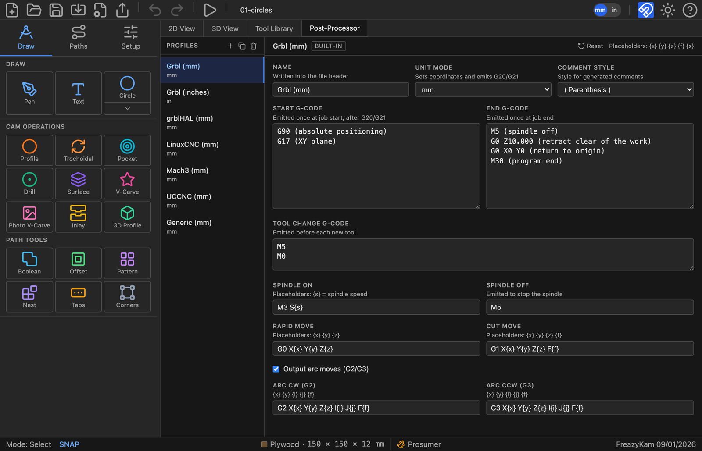
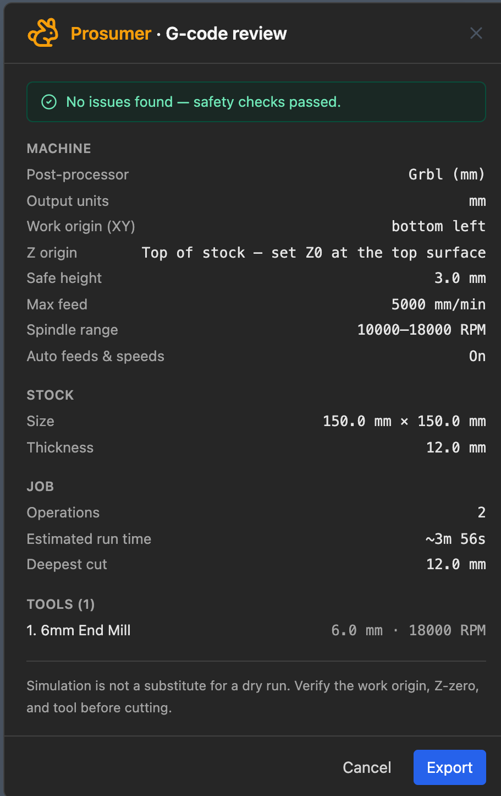

# 10. Simulating and exporting

Everything up to here has been about making toolpaths. This chapter is about the last
stretch: checking they do what you meant, translating them into your controller's dialect,
and getting the file onto the machine.

---

## The simulator

Press **Simulate G-code** in the toolbar. The program is built from every visible
operation, in Ops-strip order, and loaded into the player.

**It opens on the finished part, not on bare stock.** That's deliberate — the question you
opened the simulator to answer is usually *what does this come out like*, and showing you
the answer immediately beats making you watch four minutes of cutting first. Press
**Play** and it winds back to bare stock and animates from there.

| Control | Does |
|---|---|
| **Play / Pause** | Or the spacebar |
| **Reset** | Back to the start |
| **Seek** | Scrub anywhere in the program |
| **1× 5× 20× 100×** | Playback speed |
| **Document icon** | Opens the G-code viewer, which follows along line by line |
| **×** | Closes the simulator |

### The readouts

Two bars sit under the stock, and they are the reason to run a simulation rather than just
look at the toolpath.

**Position and progress** — the current **line number**, the tool's **Z**, the **feed**
(or `rapid`), and elapsed against total cycle time. That total is worth reading before you
commit an evening to a job.

**Spindle and chip load** — the RPM with its router dial equivalent, and the chip load as
`actual / target` with a verdict: 🔴 *rubbing · too hot*, 🟢 *sweet spot*, 🔵 *chips too
large*. See [chapter 3](03-stock-and-tools.md#the-chip-load-gauge) for the bands. On manual
feeds it also suggests the feed that would bring you back into the band.

### 2D and 3D

**2D View** plays the program flat, with a trail behind the tool. It's the quicker read
for travel moves, ordering and retracts.

**3D View** removes real material from a solid block. This is the one that tells you what
the part will look like — scallops, flat spots, an over-deep pocket. The toggles top-right
turn **Axes, Toolpaths, Stock, Tool, Shapes** and **Follow Tool** on and off.

### It keeps itself up to date

Leave the simulator open, change an operation, and **it rebuilds and reloads by itself**
once the operations settle. You don't have to press Simulate again. An imported `.gcode`
file is the exception — that program is not something the app generated, so it is left
alone.

> **What a simulation proves and what it doesn't.** It proves the toolpaths do what you
> meant — the right shapes, the right depths, in the right order. It knows nothing about
> whether your machine is trammed, your stock is where you think it is, your workholding
> will hold, or your bit is sharp. The export review says this too, and it is right to.

---

## The post-processor

Controllers disagree about the details of G-code. A **post-processor profile** is the set
of rules for turning toolpaths into the dialect yours speaks.

<!-- FULL APP · 1600 px wide, downscaled from a 2× capture. -->

Seven profiles are built in — **Grbl (mm)**, **Grbl (inches)**, **grblHAL**, **LinuxCNC**,
**Mach3**, **UCCNC** and a **Generic** one. Grbl (mm) is the default and covers most hobby
machines.

Any of them can be edited, and a built-in carries a **Reset** button that puts it back to
factory defaults, so you can experiment without losing the original. To keep both,
duplicate a profile and edit the copy.

### What's in a profile

| Setting | Emitted |
|---|---|
| **Name** | Into the file header |
| **Unit mode** | Sets the coordinates *and* emits G20/G21 |
| **Comment style** | `; semicolon`, `( parenthesis )` or none |
| **Start G-code** | Once at job start, after G20/G21 |
| **End G-code** | Once at job end |
| **Tool change G-code** | Before each new tool |
| **Spindle on / off** | `{s}` is the speed |
| **Rapid / Cut move** | `{x} {y} {z} {f}` |
| **Arc CW / CCW** | `{i} {j}` centre offsets — and a switch to turn arcs off entirely |

**Unit mode is the only thing that decides whether the file is in inches or millimetres.**
The toolbar's mm/in toggle is a display setting and has no effect on the exported file.

**Turn off Output arc moves** if your controller's arc handling is unreliable — everything
comes out as short straight moves instead. Bigger file, no arcs to misinterpret.

The **tool change** block is worth setting up properly. The default `M5` / `M0` stops the
spindle and pauses so you can change the bit and re-zero. If your controller handles tool
changes differently, this is where to say so.

---

## The export review

**Export G-code** runs a preflight check first and shows you a **G-code review** before
writing anything.

### The summary

Read the top block against reality, because this is the last point at which a mistake is
free:

- **Post-processor and output units** — is this the file your controller wants?
- **Work origin (XY)** and **Z origin** — do these match how you actually zeroed the
  machine? The Z line spells it out: *"Top of stock — set Z0 at the top surface."*
- **Safe height, max feed, spindle range** — your machine's limits as the app understands
  them.
- **Operations, estimated run time, deepest cut** — is the deepest cut deeper than your
  stock, and is the run time what you expected?
- **Tools** — every cutter the program calls for, with its speed.

### The warnings

Warnings don't block the export; the button just changes to **Export anyway**. Read them
anyway. They cover:

- Operations that **failed**, or that are **stale** because their geometry changed after
  the toolpath was generated
- Toolpath that runs **outside the stock**, or past your machine's **table travel** or
  **Z travel**
- **Tool changes and spindle commands** your controller may not act on
- **Chip load** outside a safe band, and spindles that can't run slow enough for the
  material's surface speed
- For inlays, a **male plug that doesn't match its female socket**

### Splitting by tool

If the job uses **more than one tool**, a **Split into one file per tool** option appears,
along with a **File prefix** box. The button becomes *Export N files*.

This is usually the right choice. One file per cutter means you load a bit, run its file,
and stop cleanly — rather than trusting your controller to do something sensible at a tool
change. A single-tool job doesn't offer either option.

---

## Getting it to the machine

The `.gcode` file lands in your downloads. Copy it to your controller however you normally
do.

Before you press cycle start, the things the app told you but cannot check:

1. **Zero X, Y and Z where the review said they were.**
2. **Check the first move.** Bring the tool to Z-safe and step through the opening lines
   in your sender before letting it plunge.
3. **Confirm the bit matches** the one the review named.

Then cut it.

---

## Next

- **[11. When something goes wrong](11-troubleshooting.md)** — failures, refusals, and what they mean
